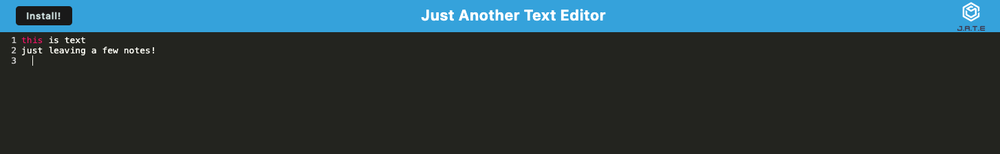

# text-editor

## Description 
Just Another Text Editor (JATE) is a web-based text editor application. It saves the data you enter directly in your browser, ensuring that your text is displayed when you revisit the page or reopen the installed version of the app. You can use JATE either through the website or by downloading a local version. 
 
## Installation 
This application is hosted online, so no installation is required to start using it. To install a local version, simply click the "Install" button within the application. 
 
## Usage 
To use JATE, simply type in the editor window. Any text you enter will be saved in your browser, so it will be retained even if you navigate away from the text editor.

## Image

## Testing

N/A

## License

MIT

## Credits

[Node.js](https://nodejs.org/en)

[NPM](https://www.npmjs.com/)

[Express.js](https://expressjs.com/)

[express-session](https://www.npmjs.com/package/express-session)

[Webpack](https://webpack.js.org/)

[Babel](https://babeljs.io/)

## Contributing

N/A

# Questions

My GitHub Profile: [orion888888](https://github.com/orion888888)